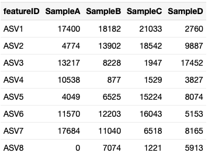
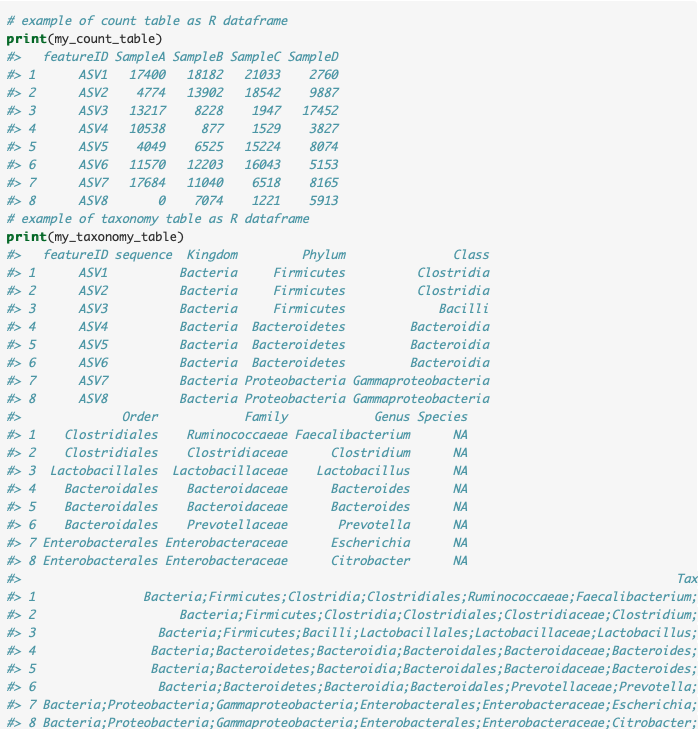
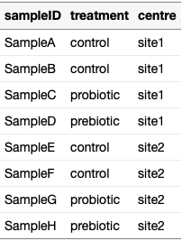
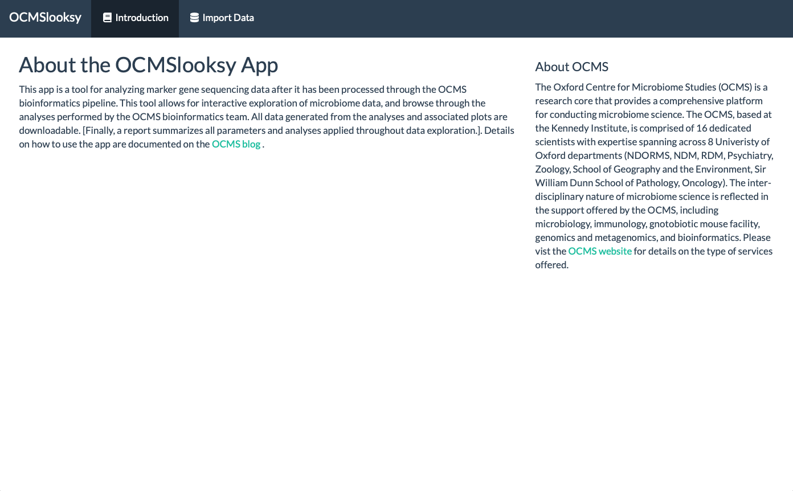

[](https://zenodo.org/badge/latestdoi/229074775)

# OCMSlooksy
OCMSlooksy is a RShiny app dedicated for exploration of 16S rRNA gene data in microbiome research. This app was made by the Oxford Centre for Microbiome Studies with the intention that collaborators can have a look-see at their microbiome data in an accessible and interactive way. The app does not process raw sequence data. Rather, it focuses on data analysis downstream of sequence processing pipelines, such as [Dada2](https://benjjneb.github.io/dada2/tutorial.html). In particular, OCMSlooksy is an extension of [OCMS_16S](https://ocms-16s.readthedocs.io/en/latest/), a 16S sequence processing pipeline that runs Dada2 as a [cgat-core](https://cgat-core.readthedocs.io/en/latest/) pipeline. OCMS 16S generates a SQLite database that is used as the input for OCMSlooksy. 16S data generated from other 16S sequence processing pipelines can still be analysed with OCMSlooksy, using the [`OCMSlooksy::create_db`](#preparing-input-data-prepareinput) function. 


# Installing OCMSlooksy
OCMSlooksy is an R package that contains the app and several helper functions that help prepare input files required for the app. The OCMSlooksy R package can be installed from the [OCMS github](https://github.com/OxfordCMS/OCMSlooksy) by running the following code in R:

```
# download and install dependency propr
wget("https://cran.r-project.org/src/contrib/Archive/propr/propr_4.2.6.tar.gz")
install.packages("propr_4.2.6.tar.gz", repos=NULL, type="source")

# download and install package
devtools::install_github("https://github.com/OxfordCMS/OCMSlooksy", 
                         build_vignettes = TRUE)
# load OCMSlooksy package
library(OCMSlooksy)
```

# Preparing Input Data
The app requires two input files: a SQLite database file and a metadata file. Both of these files have specific formatting requirements, which are detailed in this section.

## From OCMS 16S
The OCMS 16S output database would have been specified in the pipeline config file (`pipeline.yml`). The database is a SQLite database file and can be directly used as the input into OCMSlooksy.

## From count and taxonomy tables

The OCMSlooksy package includes several functions that facilitate preparing input data for the app. The `create_db()` function creates a SQLite database file from tab-delimited or comma-delimited files and configures the database such that it can be used as the input file for the OCMSlooksy app.

`create_db` has 5 arguments:

* `counts` -- file or dataframe of feature (ASV or OTU) counts for each sample
* `taxonomy` -- file or dataframe of feature taxonomy classifications
* `outdir` -- directory where database will be saved
* `db_name` -- name of database. Default `db_name = "OCMSlooksy.db"`
* `fromfile` -- Are count and taxonomy tables supplied as files (`fromfile=TRUE`) or as R dataframes (`fromfile=FALSE`)

Example code to make database file from count and taxonomy table files:

```
# not run
create_db(counts = 'my_count_table.tsv',
          taxonomy = 'my_taxonomy_table.tsv',
          outdir = '/path/to/output/directory',
          db_name = 'mydatabase.db',
          fromfile = TRUE)
```

`create_db` requires two tables: a count table which contains features (ASVs or OTUs) for each sample, and a taxonomy table which contains the taxonomy classification associated with features found in the count table. 16S rRNA gene sequence processing pipelines vary in the format of their outputs, but most provide a tab-delimitted or comma-delimited spreadsheet containing this information. You will need to re-format (or create a new file) such that the count and taxonomy tables conform to the following requirements:

 count table requirements:
 
 * samples in columns and features (ASVs or OTUs) in rows
 * first column should contain feature identities under the heading `featureID` (column name is case sensitive)
 * feature IDs must be unique
 
 Example count table:
 

 
 taxonomy table requirements:
 
 * contains taxonomy classifications that correspond to features in count table
 * first column contains feature IDs under the heading `featureID`
 * Must contain the columns `featureID`, `sequence`,
   `Kingdom`, `Phylum`, `Class`, `Order`, `Family`,
   `Genus`, `Species`, `Taxon`. Column names are case-sensitive.
 * if `sequence` for a feature is not known, you can leave the column empty
 * if `species` for a feature is not known or is not classified, set species to `NA`. The same rule applies other taxonomy levels.
 * `Taxon` contains classifications at all taxonomic levels, separated by a semicolon. Taxonomy names can be pre-pended with the initial of the taxonomy level but it is not necessary.
 (e.g. k__Bacteria;p__Firmicutes;c__Clostridia;o__Clostridiales;f__Ruminococcaceae;g__Faecalibacterium;s__NA")

Example taxonomy table:


The count and taxonomy tables can be supplied as .tsv or .csv files by setting `fromfile = TRUE` (default). Alternatively, if count and taxonomy tables are already in R, set `fromfile = FALSE` and supply dataframes to the `counts` and `taxonomy` arguments, respectively.


Example code to make database file from count and taxonomy tables already in R as `dataframe`'s



```{r example-createdb3, echo=TRUE, eval=FALSE}
# not run
create_db(counts = my_count_table,
          taxonomy = my_taxonomy_table,
          outdir = '/path/to/output/directory',
          db_name = 'mydatabase.db',
          fromfile = FALSE)
```

## Preparing metadata file
The second input file required by OCMSlooksy is a metadata file that contains sample specific details (i.e. group, treatment, replicate number, etc.). The formatting requirements for the metadata file is as follows:

* samples in rows and metadata variables in columns
* samples are identifiers are unique and match those in the database
* samples are listed in a column called `sampleID` (column name is case sensitive)
* column names do not contain special characters and do not start with a number. Spaces and dashes (`-`) are automatically replaced with underscores (`_`) within the app.

Example metadata file:



Metadata files can be manually created in a spreadsheet and saved as a .csv or .tsv file. Alternatively, the `metfile_init` function initiates a metadata file from the database file or a tab-delimited count table file. This function reads your database file and creates a bare-bones metadata file that you can add to.

`metfile_init` contains 5 arguments:

* `db_file` -- SQLite database file used as OCMSlooksy app input. Set to `FALSE` to use a count table in a tab-delimited file
* `out_dir` -- output directory where initiated metadata file will be saved. Default `NULL` means output not written to file but returns a dataframe.
* `ref_table` -- name of table in database from which sampleID are generated. default `NULL`. When `NULL`, assumes table is `merged_abundance_id` which is the count table produced from the ocms_16s dada2 pipeline or produced from `create_db`. When initiating the metadata file from a count table, set `db_file`
   to `FALSE` and count table is supplied in `ref_table` as a tab-delimited file. The count table file supplied has the same requirements as `counts` count table in `create_db` 
* `id_orient` -- indicates orientation of sample IDs. default 'col' indicates
   samples are in columns. 'row' indicates samples are in rows and
   sample IDs are in the first column
* `dummy` -- default NULL. when string supplied, adds a dummy column of NAs with the string as the column name.

Example code to initiate metadata file from database:

```
# not run
metfile_init(db_file = 'mydatabase.db',
             out_dir = '/path/to/output/directory',
             ref_table = NULL,
             id_orient = 'col',
             dummy = 'treatment')
```

Example code to initiate metadata file from count table file:
```
# not run
metfile_init(db_file = FALSE,
             out_dir = '/path/to/output/directory',
             ref_table = 'my_count_table.tsv',
             id_orient = 'col',
             dummy = 'treatment')
```

Setting the `dummy=treatment` means the metadata file initiated will have a column of `sampleID` and an empty column of `treatment`. This is, of course, optional and is there to demonstrate how the metadata file can be populated with associated variables.

# Launching the OCMSlooksy app
The app is launched from within R. To start the app, write the following command in the R console:

```
OCMSlooksy::run_app()
```

The app will launch in your browser (you don't need internet access to run the app) so you may have change your browser settings to allow pop-up windows if pop-ups are disabled.



# Vignette
A full vignette on how to use the app and its interactive features can be found on the [wiki page](https://github.com/OxfordCMS/OCMSlooksy/wiki)
